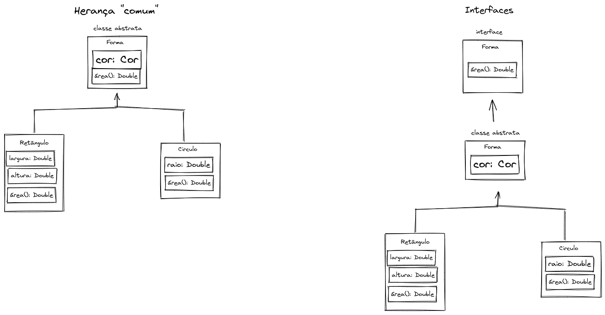

# Repositório da aula ministrada para a turma do DevInHouse na CLAMED.

POO - Herança, Polimorfismo e interface

Este é o repositório do código da aula_3_heritage refatorado para adequação da abordagem de construção com interfaces em Java.

## Diagrama de Classes

